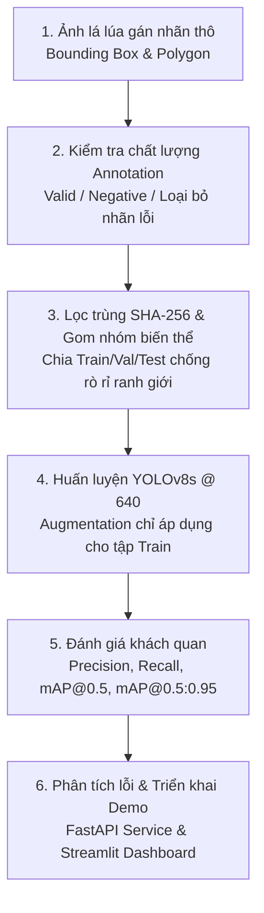

# 🌾 Rice Leaf Disease Detection
[](https://github.com/haminhthong/Rice-Leaf-Disease-Detection/actions/workflows/ci.yml)


> **Object Detection & Symptom Localization** trên phiến lá lúa bằng YOLOv8: Phát hiện và định vị các vùng tổn thương Bạc lá lúa (*Bacterial Leaf Blight*) và Đốm nâu (*Brown Spot*).

---

## 1. Định Vị Bài Toán: Object Detection, Không Phải Classification

Khác với các bài toán phân loại ảnh thông thường (*Image Classification* chỉ gán 1 nhãn tổng thể cho cả bức ảnh), dự án này tiếp cận theo hướng **Object Detection**:
- Một phiến lá có thể chứa **nhiều vết bệnh cùng lúc** hoặc đồng thời xuất hiện cả hai loại bệnh.
- Mục tiêu kỹ thuật là **khoanh vùng chính xác tọa độ tổn thương (Bounding Box)** và phân loại từng đốm bệnh cụ thể, hỗ trợ công tác trinh sát thực địa (*Field Scouting*).

```text
                  [ Ảnh Phiến Lá Lúa ]
                            │
                            ▼
                    [ Mô hình YOLOv8 ]
                            │
              ┌─────────────┴─────────────┐
              ▼                           ▼
    [ Bounding Box 1 ]          [ Bounding Box 2 ]
   Bacterial Leaf Blight            Brown Spot
     (Độ tin cậy: 92%)           (Độ tin cậy: 87%)
```

### Hai Lớp Bệnh Mục Tiêu

| Class ID | Tên Chuẩn | Tên Tiếng Việt | Đặc Điểm Nhận Diện Tổn Thương |
|---|---|---|---|
| `0` | `Bacterial_Leaf_Blight` | Bạc lá lúa | Vết sọc mọng nước dọc mép lá, màu vàng nhạt đến xám trắng do vi khuẩn *Xanthomonas oryzae* |
| `1` | `Brown_Spot` | Đốm nâu | Các đốm hình tròn hoặc bầu dục màu nâu thẫm viền vàng do nấm *Bipolaris oryzae* |

---

## 2. Quy Trình Kỹ Thuật (6 Bước Cốt Lõi)

Dự án được xây dựng theo một luồng kỹ thuật duy nhất, tinh gọn và minh bạch:



### Các Điểm Nhấn Kỹ Thuật (Engineering Highlights)
1. **Missing Annotation $\neq$ Negative Image**: Nếu ảnh không có file nhãn hoặc tọa độ lỗi, hệ thống đánh dấu là `invalid` và loại bỏ, tránh việc vô tình đưa ảnh bệnh chưa gán nhãn vào dataset dưới dạng ảnh nền (*background*).
2. **Lọc trùng SHA-256 (Exact Deduplication)**: Loại bỏ các ảnh trùng lặp tuyệt đối để cùng một nội dung ảnh không bao giờ xuất hiện ở cả tập Train và tập Test.
3. **Chia tập chống rò rỉ (Group-Aware Split)**: Gom nhóm các ảnh biến thể sinh ra từ cùng ảnh gốc (crop, rotate, pHash gần trùng) vào cùng một `group_id` trước khi chia tập Train (70%) / Val (15%) / Test (15%).
4. **Train-only Data Augmentation**: Kỹ thuật tăng cường dữ liệu (HSV, xoay, dịch chuyển, lật, mosaic) chỉ bật trong quá trình huấn luyện; tập Validation và Test dùng tiền xử lý tất định để đảm bảo tính khách quan.

---

## 3. Cấu Trúc Thư Mục Dự Án

```text
rice-leaf-disease-recognition/
├── app/
│   ├── api.py                  # FastAPI REST Service: /health, /predict
│   ├── dashboard.py            # Streamlit Interactive Web Dashboard
│   ├── dependencies.py         # Singleton detector loader
│   ├── schemas.py              # Pydantic request/response schemas
│   ├── settings.py             # Cấu hình runtime từ biến môi trường
│   └── validation.py           # Kiểm tra magic bytes & giới hạn kích thước ảnh
├── configs/
│   └── default.yaml            # Cấu hình siêu tham số mô hình & huấn luyện
├── data/
│   ├── README.md               # Data Card chi tiết
│   └── sample/                 # Ảnh mẫu thử nghiệm nhanh
├── scripts/
│   ├── prepare_data.py         # Bước 1: Làm sạch và chia tập dữ liệu
│   ├── train.py                # Bước 2: Huấn luyện mô hình YOLOv8
│   ├── evaluate.py             # Bước 3: Đánh giá mAP và per-class metrics
│   └── predict.py              # Bước 4: Chạy suy luận từ dòng lệnh
├── src/rice_leaf_detection/
│   ├── annotations.py          # Chuẩn hóa nhãn Polygon -> Bounding Box
│   ├── config.py               # Quản lý cấu hình YAML bằng Dataclass
│   ├── constants.py            # Hằng số lớp bệnh và trạng thái dữ liệu
│   ├── deduplication.py        # Lọc trùng SHA-256 và gom nhóm pHash
│   ├── error_analysis.py       # Phân loại lỗi TP, FP, FN & kích thước tổn thương
│   ├── evaluate.py             # Logic tính toán mAP và Precision/Recall
│   ├── inference.py            # RiceLeafDetector và Detection dataclass
│   ├── predict.py              # Logic suy luận dự đoán
│   ├── prepare.py              # Logic tiền xử lý và group-aware split
│   ├── train.py                # Logic huấn luyện với Ultralytics
│   └── utils.py                # Tiện ích hash, seed, safe ZIP extraction
├── tests/                      # Bộ Unit Tests toàn diện
├── MODEL_CARD.md              # Model Card (phạm vi, độ đo, giới hạn)
├── pyproject.toml             # Khai báo package và công cụ kiểm thử
└── requirements.txt            # Danh mục phụ thuộc chính
```

---

## 4. Cài Đặt Môi Trường

Yêu cầu **Python 3.10** trở lên:

```bash
# 1. Khởi tạo môi trường ảo
python -m venv .venv

# Kích hoạt trên Windows:
.\.venv\Scripts\Activate.ps1
# Hoặc trên Linux/macOS:
source .venv/bin/activate

# 2. Cài đặt package cùng các phụ thuộc mở rộng
python -m pip install --upgrade pip
pip install -e ".[app,dev]"
```

---

## 5. Hướng Dẫn Sử Dụng (End-to-End Workflow)

Toàn bộ quy trình từ dữ liệu thô đến dự đoán có thể thực thi tuần tự qua 4 script:

### Bước 1: Chuẩn Bị & Chia Tập Dữ Liệu
Giải nén dữ liệu nguồn, lọc trùng SHA-256 và chia tập Train/Val/Test chống rò rỉ:
```bash
python scripts/prepare_data.py --overwrite
```
*Kết quả sinh ra tại thư mục `data/processed/rice_leaf_detection/` gồm: `data.yaml`, `manifest.csv`, `data_report.json`.*

### Bước 2: Huấn Luyện Mô Hình YOLOv8
Huấn luyện mô hình YOLOv8s theo siêu tham số quản lý trong `configs/default.yaml`:
```bash
python scripts/train.py --epochs 50 --batch 16
```
*Trọng số tốt nhất được lưu tại `runs/train/<run_name>/weights/best.pt`.*

### Bước 3: Đánh Giá Hiệu Năng Mô Hình
Tính toán Precision, Recall, mAP@0.5 và mAP@0.5:0.95 trên tập Validation hoặc Test:
```bash
python scripts/evaluate.py --weights runs/train/yolov8s_640/weights/best.pt --split val
python scripts/evaluate.py --weights runs/train/yolov8s_640/weights/best.pt --split test
```

### Bước 4: Suy Luận Từ Dòng Lệnh (CLI Prediction)
Chạy dự đoán nhanh trên ảnh mẫu hoặc thư mục ảnh:
```bash
python scripts/predict.py --weights runs/train/yolov8s_640/weights/best.pt --source data/sample/bacterial_leaf_blight_sample.jpg
```

---

## 6. Giao Diện & Dịch Vụ Ứng Dụng

### 6.1. Streamlit Dashboard (Demo Trực Quan Cao Cấp)
Giao diện Precision Agriculture tương tác trực quan:
- **Thử nghiệm 1-click**: Tích hợp sẵn ảnh mẫu bệnh Bạc lá và Đốm nâu trong `data/sample/` để trải nghiệm tức thì mà không cần tìm kiếm file ảnh bên ngoài.
- **Phân tích định lượng**: Hiển thị bảng chi tiết tọa độ Bounding Box, tỷ lệ diện tích tổn thương (% diện tích lá) và thời gian suy luận (latency ms).
- **Khuyến cáo nông học thực tiễn**: Tự động gợi ý biện pháp kỹ thuật đồng ruộng (quản lý phân đạm/kali, chế độ nước, vệ sinh giống) tương ứng với từng mầm bệnh phát hiện được.
- **Báo cáo dữ liệu & Chống rò rỉ**: Thống kê số lượng ảnh làm sạch, ảnh trùng SHA-256 đã loại bỏ và nhóm biến thể pHash.

```bash
streamlit run app/dashboard.py
```

### 6.2. FastAPI RESTful Service
Khởi chạy API server với 2 endpoints chuẩn:
```bash
uvicorn app.api:app --host 0.0.0.0 --port 8000
```
- `GET /health`: Kiểm tra trạng thái máy chủ (`{"status": "ok"}`).
- `POST /predict`: Gửi file ảnh và nhận danh sách bounding box kèm độ tin cậy.

Gọi API bằng `curl`:
```bash
curl -X POST http://localhost:8000/predict -F "file=@data/sample/bacterial_leaf_blight_sample.jpg"
```

---

## 7. Kiểm Thử & Đảm Bảo Chất Lượng Code (CI/CD)

Hệ thống CI tự động kiểm tra định dạng, chất lượng mã nguồn và tính toàn vẹn phụ thuộc:

```bash
# Kiểm tra định dạng code
python -m ruff format --check src app scripts tests

# Kiểm tra quy chuẩn linter
python -m ruff check src app scripts tests

# Kiểm tra tính toàn vẹn phụ thuộc
python -m pip check

# Chạy toàn bộ bộ kiểm thử Unit Tests
python -m pytest -v
```

---

## 8. Khuyến Cáo & Miễn Trừ Trách Nhiệm

- **Mục đích hỗ trợ**: Mô hình là công cụ hỗ trợ thị giác máy tính phục vụ sàng lọc và trinh sát sơ bộ ngoài đồng ruộng.
- **Trách nhiệm chuyên môn**: Tuyệt đối không tự ý quyết định liều lượng hoặc phun thuốc bảo vệ thực vật khi chưa có sự thẩm định và hướng dẫn trực tiếp từ kỹ sư nông nghiệp hoặc cán bộ chuyên môn.

---

## 9. Giấy Phép (License)

Dự án được phân phối theo giấy phép mã nguồn mở [MIT License](LICENSE).
