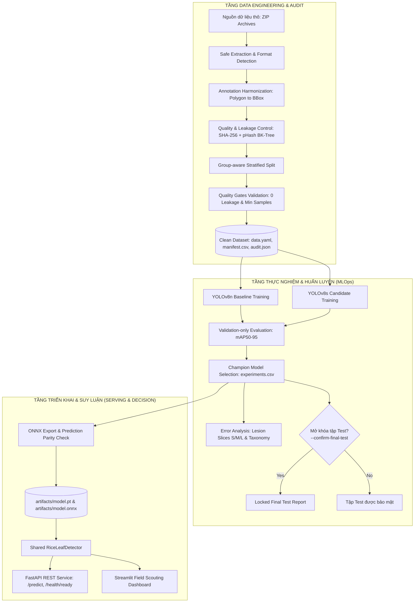
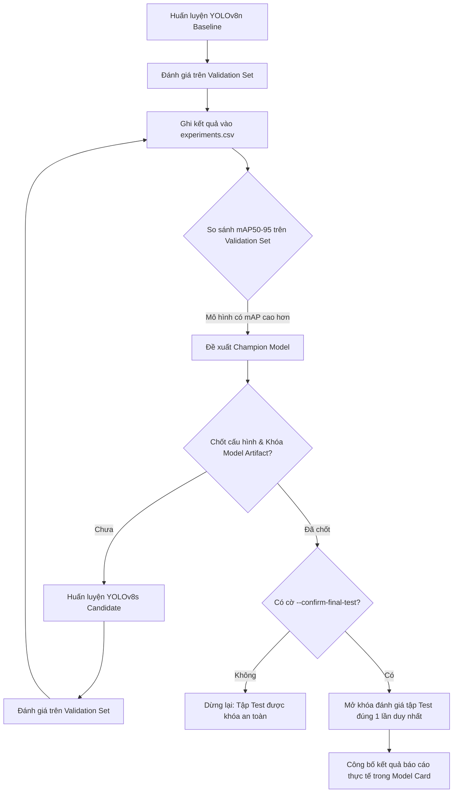
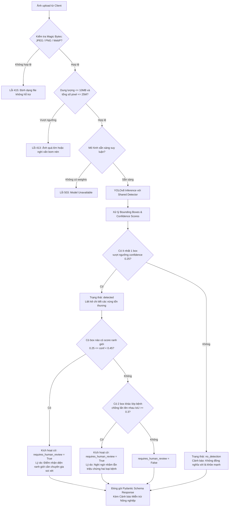
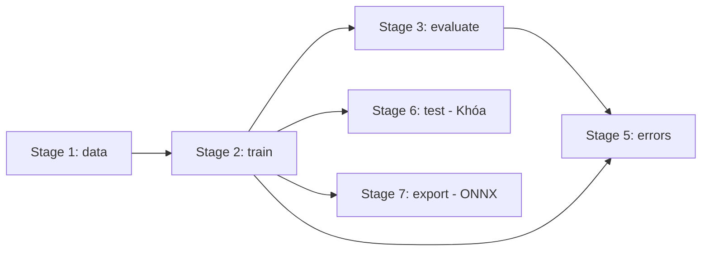

# 🌾 Luồng Dữ Liệu & Luồng Logic Hệ Thống Nhận Diện Bệnh Lá Lúa
### (Data Flow, Logic Flow & Pipeline Architecture Specification)

Tài liệu này mô tả chi tiết toàn bộ kiến trúc luồng dữ liệu (Data Flow), luồng logic nghiệp vụ và ra quyết định (Logic Flow & Decision Trees), các hợp đồng dữ liệu (Data Contracts), và bộ điều phối Pipeline Orchestrator cho bài toán **Phát hiện triệu chứng Bạc lá lúa (Bacterial Leaf Blight) và Đốm nâu (Brown Spot)** bằng YOLOv8.

---

## 1. Tổng Quan Kiến Trúc Hệ Thống (System Architecture)

Hệ thống được thiết kế theo mô hình phân tầng chặt chẽ (Layered Architecture) nhằm đảm bảo tính toàn vẹn dữ liệu, chống rò rỉ (Data Leakage) giữa các tập phân chia, và cung cấp tầng hỗ trợ ra quyết định thực địa (Field Scouting Decision Support):



---

## 2. Luồng Dữ Liệu Chi Tiết (Data Flow Architecture)

Mọi quá trình biến đổi dữ liệu trong hệ thống đều tuân thủ nguyên tắc **Bất biến nguồn (Immutable Source)**, **Truy vết mã băm (Cryptographic Lineage)**, và **Chống rò rỉ theo nhóm (Group Leakage Prevention)**.

```mermaid
flowchart LR
    subgraph RawStage["1. Raw Data"]
        Z1[RiceLeafAnnotatedDataset.zip]
        Z2[dataset1.zip]
    end

    subgraph ParsingStage["2. Parsing & Harmonization"]
        P1[Tự động đọc data.yaml nguồn]
        P2[Ánh xạ Alias tên bệnh về class 0 & 1]
        P3[Chuyển đổi đa giác Polygon thành Hộp bao BBox]
        P4[Xén viền tọa độ vào khoảng 0..1]
    end

    subgraph DedupStage["3. Deduplication & Grouping"]
        D1[Lọc trùng nhị phân tuyệt đối: SHA-256]
        D2[Trích xuất Perceptual Hash 64-bit DCT-II]
        D3[Tìm kiếm gần trùng: BK-Tree Hamming Distance <= 2]
        D4[Gom cụm biến thể: Disjoint-Set Union-Find]
    end

    subgraph SplitStage["4. Group-aware Split"]
        S1[Phân tầng theo hiện diện lớp: BLB, Brown Spot, Cả hai, Negative]
        S2[Chia Train 70% / Holdout 30% theo group_id]
        S3[Chia Val 15% / Test 15% theo group_id]
        S4[Kiểm tra rào cản chất lượng: 0 Leakage & Min 20 instances/class]
    end

    subgraph OutputStage["5. Processed Dataset"]
        O1[(train/images & labels)]
        O2[(val/images & labels)]
        O3[(test/images & labels)]
        O4[manifest.csv & audit_report.json]
        O5[data.yaml]
    end

    RawStage --> ParsingStage
    ParsingStage --> DedupStage
    DedupStage --> SplitStage
    SplitStage --> OutputStage
```



### Chi tiết các bước chuyển hóa dữ liệu:

1. **Raw Archives Ingestion**:
   - Dữ liệu thô từ các kho nén ZIP (`RiceLeafAnnotatedDataset.zip`, `dataset1.zip`) được giải nén an toàn qua cơ chế kiểm tra Path Traversal (`safe_extract_zip`).
   - Tự động phát hiện thư mục gốc chứa file `data.yaml` chuẩn YOLO.

2. **Annotation Harmonization**:
   - Tên lớp bệnh được chuẩn hóa qua danh mục từ đồng nghĩa (alias dictionary):
     * `bacterial leaf blight`, `bacterial leafblight`, `blb` $\rightarrow$ Class `0`: `Bacterial_Leaf_Blight`.
     * `brown spot`, `brown-spot`, `brownspot` $\rightarrow$ Class `1`: `Brown_Spot`.
   - Tọa độ đa giác (Polygon) với $N \ge 3$ đỉnh được tính hộp chữ nhật bao nhỏ nhất $[x_{min}, y_{min}, x_{max}, y_{max}]$, chuyển đổi thành định dạng tâm $[x_{center}, y_{center}, w, h] \in [0, 1]$ và xén viền (clipping) an toàn nếu có sai số làm tròn.

3. **Deduplication & Near-duplicate Grouping**:
   - **SHA-256**: Loại bỏ ngay lập tức các ảnh trùng lặp tuyệt đối (exact duplicates).
   - **pHash (DCT-II)**: Biến đổi Cosin rời rạc tạo chuỗi băm cảm nhận 64-bit thể hiện cấu trúc thị giác của phiến lá.
   - **BK-Tree + Union-Find**: Tìm kiếm các cặp ảnh gần trùng với khoảng cách Hamming $d \le 2$ (do cắt cúp, nén ảnh JPEG, thay đổi độ phân giải từ cùng ảnh gốc) và hợp nhất toàn bộ các ảnh này vào chung một `group_id`.

4. **Group-aware Stratified Split**:
   - Thay vì chia ngẫu nhiên theo từng ảnh đơn lẻ (dễ gây Data Leakage nghiêm trọng làm mAP cao giả tạo), thuật toán phân chia theo đơn vị `group_id`.
   - Toàn bộ biến thể của cùng một ảnh gốc luôn được đảm bảo nằm trọn vẹn trong **duy nhất một tập** (Train, Val hoặc Test).
   - Greedy Group + Source + Class aware dựa trên số ảnh, số instance lớp và `TRUE_NEGATIVE`/`OUT_OF_SCOPE_NEGATIVE`.

5. **Split Quality Gates (Rào cản kiểm soát chất lượng)**:
   - $\text{Group Leakage} = 0$: Không có bất kỳ `group_id` nào xuất hiện ở $\ge 2$ phân tập.
   - $\text{SHA-256 Leakage} = 0$: Không có ảnh nào trùng mã băm xuất hiện ở $\ge 2$ phân tập.
   - $\text{Original Key Leakage} = 0$: Không có biến thể Roboflow augmentation (`.rf.`) nào bị phân tán.
   - Cỡ mẫu tối thiểu: Val và Test phải có tối thiểu 5 nhóm ảnh và $\ge 20$ instance cho mỗi lớp bệnh.

---

## 3. Hợp Đồng Dữ Liệu Giữa Các Giai Đoạn (Data Contracts)

Mỗi giai đoạn trong hệ thống giao tiếp thông qua các file hợp đồng chuẩn hóa:

| Tên File Hợp Đồng | Định Dạng | Tầng Sinh Ra | Tầng Tiêu Thụ | Nội Dung Cốt Lõi |
|---|---|---|---|---|
| `manifest.csv` | CSV | Data Engineering | Training / Audit | Danh mục ảnh sạch: `split`, `source`, `group_id`, `sha256`, `phash`, `annotation_status`, `negative_type`, `class_0_instances`, `class_1_instances`. |
| `audit_report.json` | JSON | Data Engineering | MLOps / Reporting | Báo cáo kiểm toán: Số ảnh hỏng, nhãn polygon đã chuyển đổi, số ảnh trùng đã lọc, ma trận chéo Source x Split, phân bố kích thước vết bệnh. |
| `data.yaml` | YAML | Data Engineering | YOLOv8 Training | Đường dẫn tương đối tới `train/images`, `val/images`, `test/images` và ánh xạ tên 2 lớp bệnh. |
| `run_metadata.json` | JSON/YAML | Model Training | Model Registry | Truy vết nguồn gốc: `git_commit_sha`, `data_manifest_sha256`, `best_weights_sha256`, `seed`, `hyperparameters`. |
| `metrics.json` | JSON | Model Evaluation | Model Selection | Điểm số tổng hợp trên tập Validation: `precision`, `recall`, `mAP50`, `mAP50-95`. |
| `per_class_metrics.csv` | CSV | Model Evaluation | Error Diagnostics | Điểm số phân rã theo từng lớp bệnh: `class_id`, `class_name`, `precision`, `recall`, `AP50`, `AP50-95`. |
| `experiments.csv` | CSV | Model Evaluation | Validation Diagnostics | Lịch sử metric trên Validation; không dùng để tự chọn file trọng số ngẫu nhiên. |
| `error_summary.json` | JSON | Error Analysis | Diagnostics | Thống kê lỗi: True Positive, Missed Lesions (FN), Background False Positives (FP), phân tích theo lát cắt kích thước (Small, Medium, Large). |
| `export_metadata.json` | JSON | Model Export | Serving Layer | Checksum SHA-256 của trọng số PyTorch và file ONNX xuất ra, kích thước file, thời điểm export. |

---

## 4. Luồng Logic Nghiệp Vụ & Cây Quyết Định (Logic Flow & Decision Trees)

### 4.1. Logic Chọn Mô Hình & Khóa Tập Test (Model Selection Protocol)

Quy trình lựa chọn mô hình tuân thủ nguyên tắc khách quan nghiêm ngặt:



> [!CAUTION]
> **Quy định bất khả xâm phạm**: Tuyệt đối không dùng tập Test để tinh chỉnh ngưỡng confidence, chọn kích thước batch, chọn epoch hay lựa chọn trọng số. Tập Test chỉ được kích hoạt khi đã khóa hoàn toàn mô hình.

---

### 4.2. Logic Suy Luận Trực Tuyến & Tầng Hỗ Trợ Quyết Định (Serving Decision Flow)

Khi người dùng gửi một bức ảnh chụp lá lúa tới API hoặc Streamlit Dashboard, hệ thống thực thi chuỗi logic phòng thủ nhiều lớp:



---

## 5. Ý Nghĩa Các Trạng Thái Đầu Ra Nghiệp Vụ

| Trạng Thái Đầu Ra | Ý Nghĩa Kỹ Thuật | Ý Nghĩa Nông Học Thực Địa | Hành Động Đề Xuất |
|---|---|---|---|
| `DETECTED` | Có ít nhất một vùng đạt `accept_threshold`. | Có triệu chứng mục tiêu được mô hình hỗ trợ phát hiện. | Đối chiếu với chuyên gia nông nghiệp. |
| `REVIEW_REQUIRED` | Không có box accepted nhưng có candidate trong `[review_threshold, accept_threshold)`. | Kết quả ranh giới, chưa đủ cơ sở tự động chấp nhận. | Chuyển ảnh cho cán bộ bảo vệ thực vật thẩm định. |
| `NO_SUPPORTED_SYMPTOM_DETECTED` | Không có candidate mục tiêu qua policy. | **KHÔNG KHẲNG ĐỊNH LÁ KHỎE MẠNH**. | Kiểm tra lại ảnh hoặc bệnh ngoài phạm vi. |

---

## 6. Bộ Điều Phối Pipeline (Pipeline Orchestrator Guide)

Hệ thống cung cấp công cụ điều phối trung tâm thông qua lệnh CLI `rice-pipeline` hoặc script `python scripts/run_pipeline.py`.

### Sơ đồ luồng DAG của các Stage:



### Bảng tóm tắt các lệnh điều phối:

```bash
# 1. Kiểm tra kế hoạch thực thi và điều kiện tiên quyết (Dry Run)
python scripts/run_pipeline.py --dry-run

# 2. Chạy riêng công đoạn xử lý và chuẩn hóa dữ liệu
python scripts/run_pipeline.py --stage data

# 3. Chạy huấn luyện baseline YOLOv8n
python scripts/run_pipeline.py --stage train --epochs 10

# 4. Chạy đánh giá hiệu năng trên tập Validation
python scripts/run_pipeline.py --stage evaluate

# 5. So sánh các mô hình và đề xuất Champion Model
python scripts/run_pipeline.py --stage compare

# 6. Phân tích chi tiết các loại lỗi (Error Diagnostics)
python scripts/run_pipeline.py --stage errors

# 7. Đánh giá tập Test bị khóa (Protocol báo cáo cuối cùng)
python scripts/run_pipeline.py --stage test --confirm-final-test

# 8. Đóng gói trọng số sang ONNX và kiểm tra tương đương suy luận
python scripts/run_pipeline.py --stage export

# 9. Tự động hóa toàn bộ Pipeline từ đầu đến cuối (End-to-End Run)
python scripts/run_pipeline.py --stage all
```
